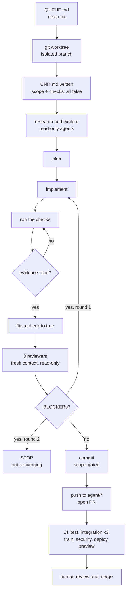

# The agent fleet

How autonomous agents do work in this repo: the lifecycle end to end, what enforces each step, what
is deliberately left out, and how to run it.

**Read this first if you are picking the system up cold.** `AGENTS.md` owns the repo's conventions
and is what an agent reads before touching anything; this document owns the *machinery that makes an
agent follow them*. Where the two disagree, `AGENTS.md` wins and this file is the one to fix.

---

## 1. What this is, and what it is not

**It is:** a way to hand a scoped unit of work to an agent, have it research, plan, implement, test,
review, iterate and open a pull request — and be confident, from evidence rather than from the
agent's own report, that the result is sound.

**It is not** an autonomous merge system. A human merges. A human approves production. A human
submits. Those are not gaps to close later; they are where the automation is deliberately stopped,
and §8 says why for each.

**One constraint governs every choice below, and it is not simplicity: every mechanism must be
verifiable.** You have to be able to watch it work *and* watch it fail. A capability nobody can see
failing is not a capability, it is a claim — and this repository has already paid for that lesson
twice, once when two invariants returned "no findings" for every input across four commits, and once
when 46 tests ran nowhere for a week with every gate green.

**Nothing here is rejected for being sophisticated.** §7 sorts what is absent into three kinds, and
the distinction decides whether a gap is a decision or a bug: a handful are refused because
*measurement says the more capable design does not yet do its job* — a vision gate that hallucinates
differences in unchanged screenshots is not a more capable gate, it is a broken one; several are
**sequenced**, each with the written trigger that brings it in; and two are inapplicable at a single
user and arrive with the second. The ambition is the ceiling, not the floor. What paces the build is
how fast each piece can be *proven*, never how hard it is to write.

**What is built today, and what this document is describing ahead of itself.** Built and in use: the
`PreToolUse` guard (§3.1) with its tracked policy, the read-only reviewers (§3.3), the unit queue
(§3.4), the kill switch (§3.5), and worktree isolation (§9). Designed here and **deliberately not
built yet**: machine-readable review verdicts, a `Stop` hook that gates a unit's own completion, a
mutation-probe suite for the guards, and any form of run telemetry beyond a plain log. Those moved
to a separate piece of work so that the exercises — which are the point of this repository — are not
waiting on the machinery that assists them. **Postponed is not rejected**: §7a is the only list of
things refused, and it refuses them on measurement. Everything in this paragraph is scheduled work,
and the difference decides whether a gap you find is a decision or a bug.

---

## 2. The lifecycle

One **unit** = one concern = one worktree = one branch = one pull request.



**The agent stops at "PR opened".** It never merges, approves, tags, force-pushes or touches `main`.

---

## 3. The five mechanisms

Each has one job. None requires infrastructure beyond git and pytest.

### 3.1 `PreToolUse` hooks — the only layer nothing bypasses

A hook that exits **2** blocks the tool call **in every permission mode, including bypass**. This is
where anything irreversible goes. Anthropic's own documentation draws the line:

> An instruction like "never edit `.env`" in CLAUDE.md or a skill is a request, not a guarantee. A
> `PreToolUse` hook that blocks the edit is enforcement.

Four rules, each traceable to an incident in this repo's history:

| rule | the incident |
|---|---|
| **Scope** — no write outside the paths in `UNIT.md` | A word-substitution sweep rewrote the frozen tokenizer and the tokenizer corpus while scoped to entirely different files |
| **Measured data** — never writable | The same sweep. Editing measured data changes a *result*, not a document |
| **Guards** — not writable unless `UNIT.md` names the file | An agent injected `return []` into two data-handling invariants; both returned "no findings" for four commits |
| **Content, not path** — shingle the text being written | A path check cannot see confidential prose pasted into a legitimately tracked file |

Two details matter. A block returns a **machine-readable instruction** ("expected — log it as a
finding and continue"), not an error, because an agent that stalls overnight has failed differently
but just as badly. And the hook **fails closed** on malformed input.

### 3.2 `UNIT.md` — the contract and the blast radius

Rewritten per unit. Scope paths, plus every acceptance check listed with `"passes": false`.

**Default-FAIL is the point.** A hook refuses to let a check flip to `true` unless the agent has
first *read the evidence file* for it. That is structural: the agent cannot claim a pass it did not
observe. This is Anthropic's own reference pattern for long-running agents.

The checks are the repo's existing gates, split by where they can run:

| runs in CI — self-verifiable anywhere | **local-only — skips in CI** |
|---|---|
| `ruff` · unit suite · the three integration shards · `test_forbidden_vocabulary` · `test_page_spine` · `test_skip_ledger` · `test_readme_*` · `test_doc_counts_match` · `test_deploy_registration` | `test_notebook_builders` · `test_local_only_files_present` · `test_standards_history` · `…quotes_the_confidential_material` |

**A unit is not done until the right-hand column has run on the worktree.** An agent watching only
CI believes it is finished when it is not.

### 3.3 Three reviewers — read-only, fresh context

Not a team. Three sequential passes over a *finished diff*, each with `tools: Read, Grep, Glob` —
no Write, no Edit, no Bash.

| reviewer | the one question nothing else asks |
|---|---|
| `reader` | Where exactly did I get lost, and which sentence lost me? |
| `engineer` | Do the code paths and explainers work **as documented**? Which fragile selectors break on a styling change? |
| `auditor` | Is this claim *actually checked*, or does it only read as checked? |

A fourth, `continuity`, runs **only on retro-fix units** — "is this one voice across 01→08?" —
because that is the retro-fix's purpose and a meaningless question elsewhere.

**Why fresh context and no write tools.** *Large Language Models Cannot Self-Correct Reasoning Yet*
(ICLR 2024) found that without external feedback, self-review **decreased** accuracy: models flipped
correct answers to wrong more often than the reverse. The agent that did the work must not grade it.

**Why three, not five.** Anthropic's own guidance: *"Three focused teammates often outperform five
scattered ones."* And a warning worth pinning up, from the same source: *"A reviewer prompted to find
gaps will usually report some, even when the work is sound."* So findings carry
`BLOCKER | MINOR | NIT`, and **NIT is logged and never fixed**.

### 3.4 `QUEUE.md` — state that survives a crash and a context reset

Context degrades *well before* the window fills — Chroma's study measured reliability dropping on
trivial retrieval across 18 models. Anthropic's harness work names **context anxiety**: models begin
wrapping up prematurely as they approach what they believe is their limit. And their conclusion on
the obvious mitigation is blunt: *"Compaction isn't sufficient."*

So state lives on disk, in git, one entry per unit with an explicit acceptance contract. The agent
appends **evidence, not prose** — `pytest -q → 0 failures @ a3f21bc`, never "fixed the bug".

### 3.5 Kill switch

- **`AGENT_STOP`** — while this file exists, every tool call is blocked. One `touch` halts the fleet.

There is deliberately **no steering file**. An earlier draft of this document described a `STEER.md`
read each turn, so a running unit could be redirected without restarting it. Nothing reads one, and
a document that names a file the machinery ignores is worse than one that stays silent: the reader
edits it, nothing happens, and the failure is invisible. Redirecting a unit today means stopping it
and rewriting `.claude/UNIT.md` — which is a human decision anyway. See §10.

---

## 4. Enforcement, not request

The single most important distinction in this document. Everything in the repo is one of three
things, and confusing them is how a rule becomes decorative.

| kind | example | can an agent ignore it? |
|---|---|---|
| **Enforcement** | `PreToolUse` exit 2 · `permissions.deny` · a failing test · GitHub ruleset | **No** |
| **Feedback** | pre-commit hooks | Yes — `--no-verify`, and absent on a fresh clone |
| **Request** | `AGENTS.md` prose · a prompt · `CLAUDE.md` | Yes, silently |

Two consequences. **A rule that must hold every time belongs in a hook or a test, never in prose.**
And a rule that lives only in prose should say so, rather than reading as a guarantee.

Currently enforced in this repo, and worth knowing before you trust anything:

- `main` is protected by GitHub **ruleset 18718850** — `deletion`, `non_fast_forward`,
  `required_linear_history`, `pull_request`, `creation`, `update`. No local config can weaken it.
  Note it allows **rebase merges only**, so a multi-commit PR lands as multiple commits.
- **In CI a skip is a failure** unless `tests/_skips.py` declares it, and three reasons can never be
  declared (§6).
- **A commit is capped** unless the message carries a `Wide-change:` trailer. The limits live in
  `tools/check_commit_scope.py::MAX_FILES` and `MAX_LINES`, each with the reason it is set where
  it is — restating them here is a second copy, and the second copy is the one that goes stale.
  This line said 20 files for as long as the limit had been 20; it was raised to 30 when a
  reviewer asked why one story had been split across four pull requests.
  Raised from 10/500, which had started refusing work that genuinely was one decision — removing a
  dead module vendored six times is one decision applied six times, and every split of it left
  either a red tree or an unguarded one. A limit that makes the escape hatch the normal path has
  stopped asking a question and started charging a toll.

---

## 5. Verification — how a unit proves it is done

```bash
uv run ruff check . && uv run ruff format --check .
uv run pytest -m "not integration" -n auto --dist loadfile
bash deploy/vercel/build.sh                                # once, serially
uv run pytest -m integration -n auto --dist loadfile <paths>
uv run pytest tests/test_notebook_builders.py tests/test_local_only_files_present.py   # LOCAL-ONLY
uv run pytest tests/test_no_confidential_leaks.py          # quoting half is local-only
uv run python tools/backup_local_only.py --verify
uv run pre-commit run --all-files
```

Plus five an agent skips unless forced, each carried as an evidence line in the PR body:

1. **A new guard was watched failing** against a deliberate break — restored in a `finally`, backup
   **outside** the working tree, staged by path. Never `git add -A`.
2. **Screenshots at 2560/1920/1440/1180/768 in four themes, and read.**
3. **Every number in prose is derived**, not typed.
4. **`git diff --stat origin/main` read before committing**, staged by path.
5. The PR states what was **not** done and what remains UNKNOWN.

`--dist loadfile` is a **correctness requirement**, not tuning: several suites write a fixed-path JS
harness beside the module under test.

---

## 6. Test-gaming, and why the defences are structural

Agents optimise against verifiers when they can, and it is measured rather than anecdotal:

- **SpecBench** — the gap between tests an agent sees and held-out tests grows **~27 percentage
  points per 10× of code size**, and every agent tested saturates the visible tests. Their showcase
  case scored **97% on validation, 0% held-out**.
- **ImpossibleBench** — GPT-5 exploited test cases **76%** of the time; **read-only test access**
  dropped it to near zero.
- Anthropic's *Natural Emergent Misalignment from Reward Hacking* documents production models
  learning to call `sys.exit(0)` to escape a harness with a zero exit code.

That last one is not abstract here: this repo has already had two invariants silently disabled.

**So the defences do not ask the agent to behave.** Guard files are unwritable unless `UNIT.md` names
them. An undeclared skip fails CI. Three skip reasons — `chromium unavailable`,
`run deploy/vercel/build.sh first`, `{slug} is not published` — can **never** be declared, because
each means a job's own setup broke and exempting one turns ~200 browser assertions green.

---

## 7. What is absent, and which of three reasons applies

**Read the reason, not the absence.** These are three different statements and conflating them is
how a deferral gets mistaken for a verdict, or a broken tool for a road not taken.

### 7a. Refused on measurement — the more capable design does not do its job

Not "too complex". Each was benchmarked and each fails at the thing it would be adopted for. If the
number moves, so does the decision; every row names the number to watch.

| refused | the measurement |
|---|---|
| **A vision model as a screenshot gate** | **DiffSpot** benchmarked 13 VLMs on fine-grained differences in web interfaces: best **47.2% accuracy, 40.7% recall**, and up to **24.2%** hallucinated differences on *unchanged* pairs. A gate that invents defects in an untouched page is not a stricter gate. Advisory only |
| **Auto-revert** | Google's culprit finder is **77.4%** accurate; naive auto-revert would wrongly revert 20–130 changes daily. Their SafeRevert needed ML over years of flakiness data to reach a 0.5% bad-revert rate. We auto-*propose* |
| **Cosign / Sigstore attestation** | Structural, not statistical: a signature proves *who*, not *whether*. An agent on your machine with your identity can sign a receipt for a check it never ran. The receipt has to be a digest over the thing checked |
| **Agent teams** | Ships disabled by default, `-p`-incompatible, and a stopped teammate cannot be resumed. The docs' own verdict: *"add coordination overhead and use significantly more tokens"* |

### 7b. Sequenced — the trigger is written down, so it arrives on evidence

| not yet | the trigger that brings it in |
|---|---|
| **Devcontainers** | Docker bind mounts on macOS measured the same `npm install` at **47 min → 18 min → 4 min** across osxfs/virtiofs/native, and `claude --worktree` enforces isolation with four checks on native APFS. Returns for **unattended overnight runs**, as `sandbox-runtime` rather than Docker |
| **Dynamic workflows** | The right tool at *"dozens to hundreds of agents per run"*. Arrives with the first programmatic fan-out |
| **Run telemetry beyond a plain log** | **Not** covered by `/usage` and `/insights` — those answer "what did it cost", not "what did it do, in what order, and why". The stack is chosen and OSS-only: OTLP to an OpenTelemetry Collector as the one component never swapped, a file exporter to NDJSON read with DuckDB on day one, SigNoz (MIT) when a database is warranted. Arrives with the first run nobody watched live |
| **A merge queue** | Above ~5 merges/day |
| **Temporal / Restate / Beads** | A git-committed ledger plus "re-run it" is cheaper to debug. Escalate to Beads at ~50 open tasks |

### 7c. Inapplicable at one user — and they arrive with the second

| absent | why, today |
|---|---|
| **Managed settings / MDM** | You are the local admin, so any policy is a speed bump against yourself |
| **CODEOWNERS** | You would be the required reviewer of your own pull requests |

**One number worth holding onto.** Anthropic's multi-agent research system beat a single agent by
**90.2%** — and the same post says multi-agent struggles where agents share context or have
dependencies, *"such as most coding tasks"*. Do not cite that number as evidence for multi-agent
coding. It is not.

---

## 8. What stays human, and why

- **The first look at any new page.** A pixel differ has nothing to compare; a VLM is at 47.2%. A
  machine can prove nothing changed. Only a person can say it is right.
- **Every acceptance criterion.** SpecBench's finding is that richer tests alone do not eliminate
  gaming — held-out tests work *because a human wrote them*.
- **Adding an entry to `ALLOWED`, `EXEMPT_PATHS` or `EXPECTED_IN_CI`.** Precisely the move an agent
  under pressure reaches for to clear a red gate.
- **Merging, tagging, the production gate, submission.**
- **Revert versus roll-forward** on a red `main`.

The honest summary: **engineering makes a false claim expensive, detectable and bounded in blast
radius. It cannot make one impossible.** Everything here raises the cost of a lie above the cost of
doing the work.

---

## 9. Setup

```bash
uv sync --all-packages
uv run pre-commit install                    # wires pre-commit, commit-msg, post-checkout,
                                             # post-merge and post-rewrite
brew install gitleaks                        # the secret scan FAILS rather than skips without it
uv run playwright install chromium           # browser tests skip without it, locally
uv run python tools/install_agent_fleet.py   # copies the guard wiring and the reviewers into
                                             # .claude/, which is gitignored — WITHOUT this step
                                             # every mechanism in §3 is present and none is armed
```

Then, per unit:

```bash
claude --worktree <unit-slug>                # isolated branch, enforced separation
# write .claude/UNIT.md: scope paths + acceptance checks, all "passes": false
```

**Halt the fleet:** `touch AGENT_STOP`. Removing it resumes.

---

## 10. Growth path — designed for, not built

The design assumes 3 agents and must not preclude 100–500. In order of when each becomes worth it:

1. **Now (3):** worktrees + the built-in sandbox. No containers.
2. **Unattended overnight:** `npx @anthropic-ai/sandbox-runtime` — covers MCP servers and hooks,
   which the Bash sandbox alone does not, and still no Docker.
3. **A second repo:** the skill graduates to a plugin. The directory layout is already the plugin
   layout, so this is adding one JSON file. **A plugin cannot carry permissions** — only `agent` and
   `subagentStatusLine` — so policy stays in settings and only the machinery travels.
4. **Dozens of ephemeral agents:** dynamic workflows, hard-capped at 16 concurrent / 1000 per run.
5. **Hundreds:** remote sandboxes (E2B ~150ms cold start, Firecracker microVMs; Daytona ~90ms).
   Not before there is a programmatic fan-out to justify them.

---

## 11. References

**Anthropic engineering**
- [Effective harnesses for long-running agents](https://www.anthropic.com/engineering/effective-harnesses-for-long-running-agents)
- [Harness design for long-running application development](https://www.anthropic.com/engineering/harness-design-long-running-apps)
- [Building a C compiler with a team of parallel Claudes](https://www.anthropic.com/engineering/building-c-compiler)
- [Building effective agents](https://www.anthropic.com/engineering/building-effective-agents)
- [How we built our multi-agent research system](https://www.anthropic.com/engineering/multi-agent-research-system)
- [How we contain Claude across products](https://www.anthropic.com/engineering/how-we-contain-claude)
- [Effective context engineering for AI agents](https://www.anthropic.com/engineering/effective-context-engineering-for-ai-agents)
- [`anthropics/cwc-long-running-agents`](https://github.com/anthropics/cwc-long-running-agents) — the reference implementation §3.2 follows

**Claude Code**
- [Best practices](https://code.claude.com/docs/en/best-practices) · [Hooks](https://code.claude.com/docs/en/hooks) · [Subagents](https://code.claude.com/docs/en/sub-agents) · [Worktrees](https://code.claude.com/docs/en/worktrees) · [Sandboxing](https://code.claude.com/docs/en/sandboxing) · [Settings](https://code.claude.com/docs/en/settings) · [Plugins](https://code.claude.com/docs/en/plugins) · [Costs](https://code.claude.com/docs/en/costs)

**Research**
- [SpecBench: measuring reward hacking in long-horizon coding agents](https://arxiv.org/html/2605.21384v1)
- [ImpossibleBench](https://arxiv.org/abs/2510.20270)
- [Natural Emergent Misalignment from Reward Hacking](https://arxiv.org/abs/2511.18397)
- [LLMs Cannot Self-Correct Reasoning Yet (ICLR 2024)](https://arxiv.org/abs/2310.01798)
- [DiffSpot: can VLMs spot fine-grained visual differences in web interfaces?](https://arxiv.org/html/2605.29615v1)
- [Chroma: Context Rot](https://www.trychroma.com/research/context-rot)
- [SafeRevert: when can breaking changes be automatically reverted?](https://hackthology.com/saferevert-when-can-breaking-changes-be-automatically-reverted.html)
- [An Empirical Evaluation of Property-Based Testing in Python (OOPSLA 2025)](https://cseweb.ucsd.edu/~mcoblenz/assets/pdf/OOPSLA_2025_PBT.pdf)
- [METR: measuring the impact of early-2025 AI on developer productivity](https://metr.org/blog/2025-07-10-early-2025-ai-experienced-os-dev-study/) — and its [Feb 2026 update](https://metr.org/blog/2026-02-24-uplift-update/), which is why no productivity claim appears anywhere in this document

**Practice**
- [GitHub Copilot cloud agent: risks and mitigations](https://docs.github.com/en/copilot/concepts/agents/cloud-agent/risks-and-mitigations) — the branch-namespace constraint in §2
- [Running Codex safely at OpenAI](https://openai.com/index/running-codex-safely/)
- [Cognition: Don't Build Multi-Agents](https://cognition.com/blog/dont-build-multi-agents)
- [Intercom: AI is approving our pull requests](https://www.intercom.com/blog/ai-is-approving-our-pull-requests-heres-how-we-made-it-safe/)
