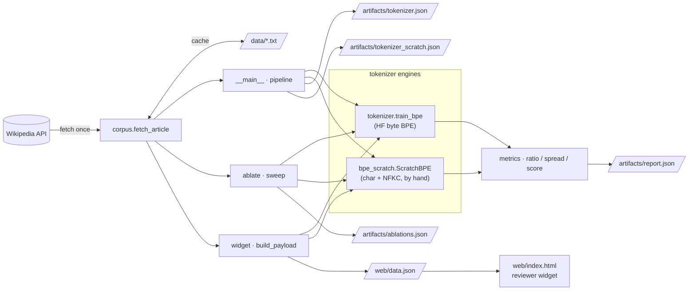
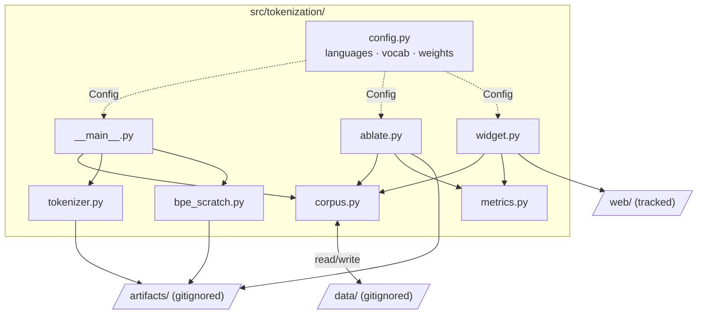
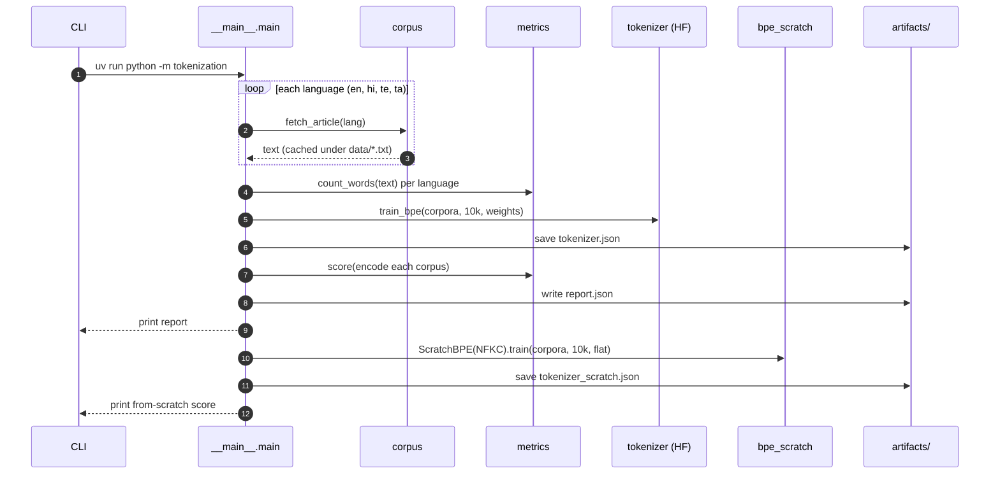

# 02 · Tokenization — a balanced multilingual BPE

Session 2 assignment (see [`BRIEF.md`](./BRIEF.md)). Build **one 10,000-token BPE vocabulary**
shared across India's Wikipedia article in **English, Hindi, Telugu, and a fourth language**, tuned
so all four are tokenized about equally efficiently. Score = `1000 / (max ratio − min ratio)`.

## Layout

```text
src/tokenization/
  config.py      # languages, vocab size, per-language upsampling weights
  corpus.py      # fetch + cache the "India" article per language (Wikipedia API)
  tokenizer.py   # train / save / count — a byte-level BPE shared across scripts (HuggingFace)
  bpe_scratch.py # the same BPE algorithm written by hand — no library (char-level + NFKC)
  metrics.py     # words, ratio (tokens/words — fertility), spread, score
  ablate.py      # experiment harness: Spec / run / sweep / SUITE
  __main__.py    # pipeline: fetch → train → evaluate → report
web/             # zero-dependency reviewer widget (index.html + exported data.json)
tests/           # metrics unit tests + a tiny offline BPE integration test
```

Fetched articles are cached in `data/` and outputs land in `artifacts/` — both git-ignored and
recreated by a run. A run writes `tokenizer.json` (the HuggingFace byte-BPE baseline),
`tokenizer_scratch.json` (the hand-written char-level BPE), and `report.json` (the baseline scores).

## How it fits together

Three entry points share the same corpus-fetch + score core, and write to three separate concerns
(cached `data/`, gitignored `artifacts/`, tracked `web/`). GitHub renders the Mermaid below inline.

### Pipeline flow — the three runnable modules



### Component & data map — who reads/writes what



### Sequence — a single `uv run python -m tokenization`



## Run it

```bash
uv sync --all-packages        # installs this member (tokenizers, requests) into the shared venv
uv run python -m tokenization # fetch, train the shared 10k BPE, print + save the report
```

Example `report.json` (the byte-level baseline — see the ablations below for how to beat it):

```json
{
  "vocab_size": 9734,
  "languages": [
    { "code": "en", "words": 10121, "tokens": 12489, "ratio": 1.23 },
    { "code": "hi", "words": 8078,  "tokens": 28288, "ratio": 3.50 },
    { "code": "te", "words": 2511,  "tokens": 14346, "ratio": 5.71 },
    { "code": "ta", "words": 10297, "tokens": 67017, "ratio": 6.51 }
  ],
  "spread": 5.27,
  "score": 189.59
}
```

## The assignment work (how to raise your score)

The baseline trains one BPE on the plain concatenation of all four articles — a fine start, but the
languages won't be balanced. To shrink the ratio **spread** (and raise the score):

- Tune `Language.weight` in `config.py` — upsample the languages that tokenize worst so they win more
  of the shared 10k merges.
- Try different pre-tokenization / normalization.
- Pick your 4th language deliberately (`config.py`, default Tamil `ta`).

## Ablations

`src/tokenization/ablate.py` sweeps tokenizer variants (algorithm × representation ×
normalization × vocab size × corpus weighting) and ranks them by score:

```bash
uv run python -m tokenization.ablate   # prints a table, writes artifacts/ablations.json
```

Add an experiment by appending a `Spec` to `SUITE`. Current leaderboard on the India articles:

| experiment | spread | score |
| --- | --- | --- |
| Unigram · char · 10k · NFKC | 0.48 | **2078** |
| **BPE from scratch · char · 10k · NFKC** (no library) | 0.77 | **1300** |
| char BPE · 10k · NFKC (HuggingFace) | 0.81 | 1228 |
| byte BPE · 10k (baseline) | 5.27 | 190 |

**Headline:** the dominant lever is the **representation**, not corpus weighting. Byte-level BPE
explodes each Indic character into 3 UTF-8 bytes (Tamil ≈ 6.5 tokens/word); switching to
**char-level + Unigram + NFKC** drops every language to ~1.7–2.2 tokens/word, cutting the spread
5.27 → 0.48 — an ~11× score jump. Corpus weighting only bites when the vocab is scarce (byte 2k),
is inert once the vocab saturates (byte 10k), and can *over-correct* at char level.

## BPE from scratch (no library)

`src/tokenization/bpe_scratch.py` implements the byte-pair-encoding algorithm by hand — the classic
Sennrich/​Karpathy merge loop, no HuggingFace:

1. NFKC-normalize, split on whitespace, prefix each word with `▁` (so merges stay within words).
2. Seed the vocab with the base characters, then repeatedly **count adjacent symbol pairs, merge the
   most frequent, and append it to the vocab** until it reaches 10k. Pair statistics are updated
   incrementally (only words containing the merged pair are touched), so training stays fast.
3. `encode` replays the learned merges in order; ties during training break lexicographically, so
   training is fully deterministic.

It duck-types the small slice of the HuggingFace API the pipeline uses (`encode().ids`,
`get_vocab`, `get_vocab_size`), so it drops into the ablation harness (`algo="bpe-scratch"`) and the
widget with no other changes. On the India articles it scores **1300** — narrowly **beating**
HuggingFace's own char-level BPE (1228) on the same recipe, and behind only the different Unigram
algorithm. Run it inside the sweep with `uv run python -m tokenization.ablate`.

## Widget (the reviewer deliverable)

`web/index.html` is a zero-dependency page that renders the exported `web/data.json`: the four ratios
(X₁…X₄), token stats, the `1000 / (X₄ − X₁)` score calculation, and the **full searchable token list**
so a reviewer can inspect the whole vocabulary. Tabs switch between the ablation configs.

```bash
cd web
python3 -m http.server 8000   # open http://localhost:8000
```

> **Hosting:** deploys via the repo-wide **Vercel** project at `/02-tokenization/` (see
> [`deploy/`](../../../deploy/)); the single-project + routing setup serves every exercise. Connecting
> the Vercel project to the repo is the remaining one-time step. Netlify (the prior host) is
> deactivated in `deploy/netlify/`, pending decommission.

## Tests

```bash
uv run pytest -m "not integration"   # metrics math (fast)
uv run pytest -m integration         # trains a tiny BPE and checks round-trip
```
