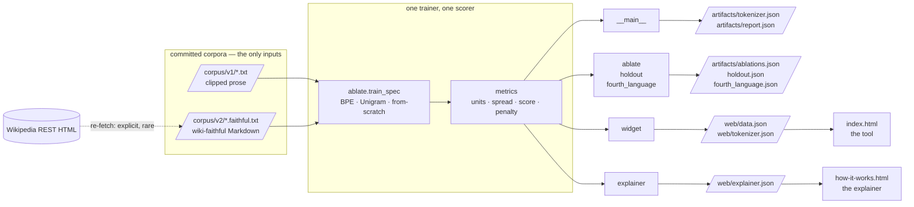
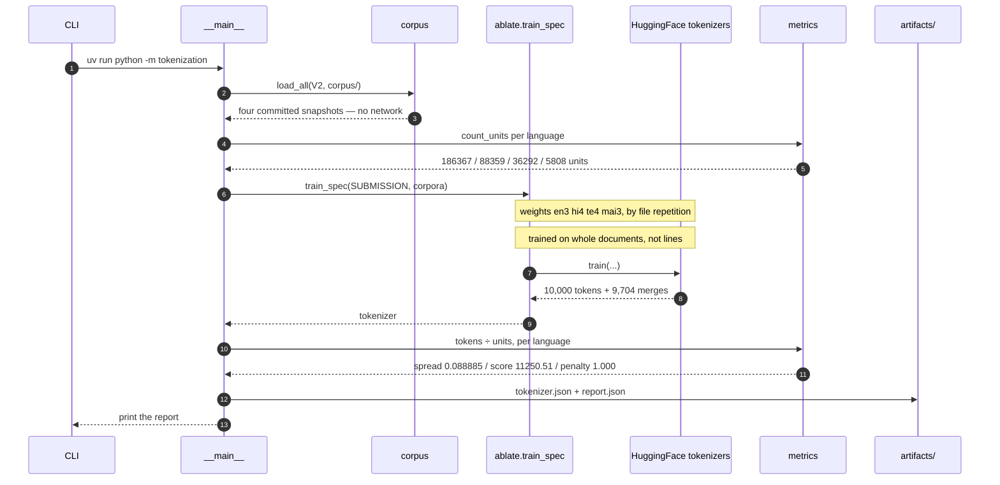

# 02 · Tokenization — a balanced multilingual BPE

Session 2 assignment. Build **one 10,000-token BPE vocabulary**
shared across India's Wikipedia article in **English, Hindi, Telugu, and a fourth language**, tuned
so all four are tokenized about equally efficiently.

```text
X(language)  = tokens / faithful units
raw score    = 1000 / (X_max − X_min)
penalty      = exp(max(0, X_hi / 1.2 − 1))
final score  = raw score / penalty
```

## Two measurements, kept side by side

This exercise has been measured two different ways, and **both are retained here** — not as old
and new, but as two things that answer different questions:

| | **v1** — our original experiments | **v2** — the graded measurement |
| --- | --- | --- |
| corpus | clipped article prose (`explaintext`) | wiki-faithful Markdown |
| denominator | whitespace **words** | **faithful units** |
| Hindi penalty | none (as designed) | yes |
| languages | en · hi · te · **ta** | en · hi · te · **mai** |
| lives in | `corpus/v1/` | `corpus/v2/` |

**Their scores can never be ranked against each other.** The same tokenizer reads ≈ 2.13 under v1
and ≈ 0.60 under v2 — four times as many atoms in the denominator, on a corpus four times the
size. Every table, the report, and the widget keep them in separate labelled sections, and
`ablate.sweep` raises if you try to sort rows from both at once.

Both run from committed corpora, offline: `uv run python -m tokenization.ablate` prints both
tables.

## v1 — our original experiments (retained, still runnable)

| experiment | spread | score |
| --- | ---: | ---: |
| Unigram · char · NFKC | 0.4813 | **2,077.90** |
| **BPE from scratch · char · NFKC** (no library) | 0.7692 | **1,300.12** |
| char BPE · NFKC (HuggingFace) | 0.8141 | 1,228.34 |
| byte BPE (baseline) | 5.2744 | 189.59 |

**The finding, which still stands:** *representation is the dominant lever*, not corpus weighting.
Byte-level BPE spends its budget rebuilding every Indic character out of three UTF-8 bytes (Tamil
≈ 6.5 tokens/word); char-level + NFKC drops every language to ~1.4–2.2 and cuts the spread ~11×.
Weighting only bites while the vocabulary is scarce — at 2k it moves the score, at 10k it is
inert — and it *over-corrects* at char level, where `balance` drags Telugu to 1.00 and pushes
English and Tamil past 1.9.

These numbers are regenerated from `corpus/v1/` on every run and pinned by
[`tests/test_v1_retained.py`](./tests/test_v1_retained.py). That guard matters because v1 and v2
share an engine: four settings v2 introduced (training from files, `[UNK]`, `min_frequency=1`,
Metaspace `prepend_scheme="never"`) each move v1's numbers, so `ablate._v1` pins all four
explicitly rather than inheriting them.

## v2 — the graded measurement

The submitted tokenizer, on the committed corpus:

| language | units | tokens | X = tokens/unit |
| --- | ---: | ---: | ---: |
| English | 186,367 | 110,985 | 0.5955 |
| **Hindi** | 88,359 | 50,868 | **0.5757** ← best |
| **Telugu** | 36,292 | 24,119 | **0.6646** ← worst |
| Maithili | 5,808 | 3,813 | 0.6565 |

```text
spread      = 0.664582 − 0.575697 = 0.088885
raw score   = 1000 / 0.088885     = 11,250.51
penalty     = 1.000000            (X_hi is nowhere near 1.2)
final score = 11,250.51
```

189,785 tokens for the whole corpus, against the benchmark's 191,266 — so the score improved and
the tokenizer got better at its job, rather than one being traded for the other.

Reproduce it with `uv run python -m tokenization` — offline, from files in this repo.

## What a "unit" is, and why it is not a word

The denominator is a **faithful unit**: one contiguous run of letters/marks/digits, or one visible
non-space punctuation character. `भारत` is one unit; `](` is two; whitespace is never a unit.

This matters more than it sounds. Counting whitespace-separated *words* instead gives numbers four
times smaller and in a completely different band, so the two are not interchangeable — a fertility
of 0.60 and one of 2.13 can describe the same tokenizer. The report prints word counts alongside
unit counts precisely so that gap is visible rather than confusing.

Fertility below 1.0 is normal here: BPE merges frequent punctuation runs like `](` into single
tokens, so one token can cover two or three units.

The corpus is **wiki-faithful Markdown** — Wikipedia's REST HTML converted with `markdownify`,
keeping links, URLs, tables, references, image links, navboxes and categories. Not clipped prose.
The four snapshots live in [`corpus/`](./corpus/) and are committed, so training, evaluation and
every published number happen offline and identically on a fresh clone.

## The gate: reproducing the reference exactly

Before claiming any improvement, the harness has to prove it measures the same thing the reference
solution measures. `SUITE`'s first row is that recipe — HF BPE · 10k · `min_frequency=1` · NFKC ·
`Metaspace("▁", prepend_scheme="never")` · `[UNK]` · weights 3/4/4/2 — and it reproduces to the
last digit: tokens **111,390 / 51,190 / 24,428 / 4,258**, spread **0.153786**, score **6502.56**.

Getting there turned up the single most important detail in this exercise. HuggingFace splits
*files* into lines, so training from files means **no merge may span a newline**. Hand the same
trainer whole documents instead and it learns cross-line pairs, lowering every token count by
~0.6% and lifting the score to 6771 — same recipe, different number. It is not a rounding
difference and it is not visible in the config; only the exact-match gate catches it.

### What we tested, and how

Four things can be varied, and we varied them one at a time so each row differs from the benchmark
in a single, nameable way.

| Knob | What it means | Values tried |
| --- | --- | --- |
| **Corpus weights** | How many times each language's article is fed to the trainer. `mai ×3` means Maithili's article is read three times. The vocabulary is a fixed 10,000 slots shared by all four, so more copies wins more slots. | mai ×2…×16 · te ×5, ×6 |
| **Training unit** | Whether the trainer is handed *files* (split into lines, so no merge may cross a line break) or *whole documents*. | lines · documents |
| **Algorithm** | BPE merges character pairs upward; Unigram starts large and prunes down. Our from-scratch BPE is the same algorithm with no library. | BPE · Unigram · from-scratch |
| **Representation** | Bytes or characters. Tested exhaustively under v1, where it turned out to dominate everything else. | byte · char |

**Why weights are the interesting knob.** The articles are wildly unequal — English is 186,367
units and Maithili 5,808, a 32× difference. At the benchmark's `mai ×2`, Maithili is **1.1%** of
the text the trainer actually reads, so it wins almost no vocabulary of its own and comes out the
worst-served language. Feeding it three times takes it to **1.6%**. The entire improvement turns
on a language that never exceeds two percent of the mix.

**How each row is validated.** Three checks, in increasing order of how much they can actually
settle:

1. **Exact reproduction** — the benchmark row must print 6502.56 or the measuring apparatus is
   wrong and nothing else counts. Asserted in `tests/test_submission.py`.
2. **Two numbers, not one** — every row reports its score *and* its total token count. The score
   only measures evenness, so a row that improves the score while using more tokens has bought
   fairness by getting worse. That is how the 35,604 row was caught.
3. **Held-out scoring** — train on 80%, score the 20% never seen. This one **failed to settle
   anything**, and that is itself a result: see below.

Every number below regenerates from committed files with the network off.

### Experiments on the graded corpus

All v2 rows share one corpus, so the recipe is the only thing that varies. The first row is the
reference solution reproduced exactly; everything below it is ours.
`uv run python -m tokenization.ablate` → [`artifacts/ablations.json`](./artifacts/).

| experiment | spread | score | total tokens | corpus-wide X |
| --- | ---: | ---: | ---: | ---: |
| more Telugu + Maithili (rejected) | 0.0281 | 35,604 | 192,713 | 0.6083 |
| te ×5 · mai ×6 | 0.0656 | 15,254 | 191,893 | 0.6057 |
| **documents · mai ×3 — submitted** | **0.0889** | **11,251** | **189,785** | **0.5990** |
| documents · mai ×4 | 0.0893 | 11,203 | 189,801 | 0.5991 |
| documents · mai ×5 | 0.0910 | 10,985 | 189,910 | 0.5994 |
| documents · mai ×6 | 0.0915 | 10,934 | 190,055 | 0.5999 |
| mai ×6 alone (lines) | 0.0957 | 10,445 | 191,446 | 0.6043 |
| Unigram (ablation) | 0.1138 | 8,787 | 207,782 | 0.6558 |
| documents, not lines | 0.1477 | 6,771 | 189,822 | 0.5991 |
| the reference solution (benchmark) | 0.1538 | 6,503 | 191,266 | 0.6037 |
| mai ×10 (overshoot) | 0.1577 | 6,279 | 190,865 | 0.6068 |
| BPE from scratch, no library | 0.1619 | 6,175 | 188,091 | 0.5937 |
| mai ×16 (overshoot) | 0.2353 | 4,217 | 191,861 | 0.6101 |

Two changes to the reference, each justified separately:

- **Train on documents.** Costs nothing and helps everything: fewer tokens for the same text
  *and* a smaller spread. Pure compression, no denominator games.
- **Maithili ×3.** Maithili's article is 1.8% of the corpus and shares Devanagari with Hindi, so it
  won almost no merges of its own and sat at the worst fertility — ×2 leaves it at 1.1% of the
  training mix, ×3 takes it to 1.6%. Spread is `max − min`, so pulling the *maximum* down is the
  honest direction. Sweeping ten weights shows the peak sits at ×3 and falls away on both sides:
  past it, Maithili becomes the new *minimum* and the spread reopens from the other end
  (×10 → 6,279, ×16 → 4,217).

Composed, they give the submission — the best score of the honest family *and* its best
compression, both measured on the whole corpus.

### Why not the row that scores 3× higher

The `more Telugu + Maithili` row scores 35,604 and is not submitted. The reason is **total
tokens**, not held-out performance:

| | score | total tokens | English | Hindi |
| --- | ---: | ---: | ---: | ---: |
| benchmark | 6,503 | 191,266 | 0.598 | 0.579 |
| **submitted** | 11,251 | **189,785** | 0.596 | 0.576 |
| rejected | **35,604** | 192,713 | 0.617 ↑ | 0.589 ↑ |

It reaches near-perfect evenness by making **English and Hindi worse** and needs ~3,000 more tokens
for the same corpus. A score that only measures the gap between languages cannot see that; the
token count can.

### The test that did not work

The obvious way to catch tuning-against-your-own-test is to hold text back. We built it
(`uv run python -m tokenization.holdout`), and it **cannot rank these recipes** — which is worth
reporting rather than hiding, because it was our first justification for the submission and it did
not survive scrutiny.

Held out every 5th line, five different ways:

| recipe | the five held-out scores | mean | **std dev** |
| --- | --- | ---: | ---: |
| benchmark | 3168 · 9320 · 4898 · 5539 · 12589 | 7,103 | **3,802** |
| submitted | 3687 · 8013 · 4981 · 6800 · 10956 | 6,888 | **2,815** |
| rejected | 4103 · 10311 · 5998 · 8144 · 9125 | 7,536 | **2,487** |

One recipe swings **9,421 points** depending only on which fifth was hidden, while the three means
sit **648 apart**. The noise is over ten times the difference being measured. Four articles is
simply too little text: the score depends on the two extreme languages, and the smaller of them
contributes about 1,100 units to a held-out slice.

Reported honestly, including the inconvenient part: **on these averages the rejected recipe comes
out slightly ahead.** That is not evidence for it — the comparison is meaningless in either
direction — but it does mean held-out scoring is not what rules it out. Total tokens is.

An earlier version of this README claimed the submission won on held-out text. That came from a
single split, and it was wrong.

### The fourth language

The reference chose Maithili; we also fetched Tamil with the same pipeline
(`uv run python -m tokenization.fourth_language` → [`artifacts/fourth_language.json`](./artifacts/)).

| set | spread | score | worst language |
| --- | ---: | ---: | --- |
| en/hi/te/**mai** · reference weights | 0.1477 | 6,771 | mai |
| en/hi/te/**mai** · tuned (mai ×3) | 0.0889 | 11,251 | te |
| en/hi/te/**ta** · reference weights | 0.0958 | 10,441 | te |
| en/hi/te/**ta** · tuned (te ×6) | 0.0681 | 14,690 | ta |

The scores are not comparable across sets — they are different corpora. The finding is
*structural*: Maithili's article is 5,808 units in a script Hindi already pays for, while Tamil's
is 188,367 units (larger than English) in a script nothing else uses. Swapping them moves which
language is starved, and therefore which weight is worth raising — with Maithili the binding
constraint is Maithili, with Tamil it moves to Telugu, now the smallest corpus by a factor of five.

## Faithfulness

> `decode(encode(text))` must preserve the same non-whitespace characters as `text`.

A tokenizer that quietly drops brackets or number separators posts a lovely token count while no
longer representing its input. [`tests/test_faithfulness.py`](./tests/test_faithfulness.py) runs
the rule against all four real articles, and every invariant is also run against something
deliberately broken so the guard is known to be able to fail. Three details decide whether it means
anything:

- **The baseline is post-NFKC.** The recipe normalizes before tokenizing, and NFKC genuinely
  rewrites characters (`″`→`′′`, `ⓘ`→`i`, thin spaces). Comparing against raw text fails every
  correct tokenizer, including the reference one.
- **Zero `[UNK]` is asserted, not assumed.** Unknown characters are dropped on decode, so they
  would sail straight past a round-trip check — both sides lose the same character. Train and eval
  share these files, so coverage is total; the test is what keeps that true.
- **Raw `U+2581` is banned from the corpus.** Decode turns every `▁` back into a space, so a
  genuine one in the input would be silently rewritten. There is none, so we assert its absence
  rather than escape the marker — escaping would change the token stream and with it the score.

## A criticism of the metric we just optimized

Having reproduced the score faithfully, it is worth saying what it does and does not measure.

**It rewards flatness, not quality.** `1000 / (X_max − X_min)` is maximized by making every
language equally mediocre. The Hindi penalty is meant to block that, but it only fires above
X = 1.2 and every configuration here sits near 0.6 — so on this corpus the guard is inert and the
exploit is unguarded. That is why every table above reports **corpus-wide X** next to the score:
a config that shrinks the spread while raising that number has flattened the languages rather than
improved them, and you can see it happen in the E2 rows.

**Much of what it measures is script-independent.** Punctuation alone is the majority of faithful
units in every language (en 52.0%, hi 52.3%, te 55.6%, mai 55.8%, ta 52.2%), and the "Indic"
articles are roughly half Latin letters by volume once URLs and link text are counted — 48.5% for
Hindi, 48.3% for Telugu, and 57.0% for Tamil. Markdown scaffolding is identical across languages,
so a good chunk of the convergence the score rewards is handed to the tokenizer by the corpus
format rather than earned by the merges.

## BPE from scratch (no library)

[`bpe_scratch.py`](./src/tokenization/bpe_scratch.py) implements the Sennrich/Karpathy merge loop
by hand: NFKC-normalize, split on whitespace, prefix each word with `▁`, seed the vocab with base
characters, then repeatedly merge the most frequent adjacent pair (pair statistics updated
incrementally; ties broken lexicographically, so training is deterministic). It duck-types the
slice of the HuggingFace API the pipeline uses, so it drops into the harness as `algo="bpe-scratch"`
and appears in **both** profiles.

Its two results say different things, which is a good illustration of why the profiles are kept
apart:

- **Under v1 it scores 1,300 — narrowly *beating* HuggingFace's own char-level BPE (1,228)** on the
  same recipe, behind only the different Unigram algorithm.
- **Under v2 it scores 6,175 — *below* the HuggingFace recipe (6,503).** It does produce the
  fewest total tokens of any configuration (188,091), which is worth being precise about rather
  than proud of: it splits on *all* whitespace and discards newlines entirely, so it never spends
  a token on one. On clipped prose that costs almost nothing; on Markdown, where line structure
  carries meaning, it is a real difference in what is being counted rather than a better merge
  loop.

## Widget (the reviewer deliverable)

[`web/index.html`](./web/index.html) renders `web/data.json`: the four fertilities, the score
calculation with its penalty, the full searchable vocabulary, a **download** button, and a
**paste-your-own-text encoder** that runs the real merge list in the browser.

The long-form explanation lives beside it at
[`web/how-it-works.html`](./web/how-it-works.html) — what a tokenizer is doing, what a weight of
`×3` actually means, a dial over ten real training runs, and the five-slice figure showing why
held-out scoring cannot rank these. The tool links to it from the top so the landing page stays a
tool rather than an essay.

It opens on **v2** with the reference solution marked ★ and our submission ✓, and a second tab
holds the **v1** tokenizers. Each section names the denominator it is scored in and says in words
that its numbers do not travel to the other — a `units` column header over word counts is exactly
how two measurements get quietly conflated.

The download and the encoder are the point. *"A vocab list without the actual encoding algorithm is
not enough to reproduce your score"* — so `data.json` carries the **ordered merges**, and
[`web/encoder.js`](./web/encoder.js) is the algorithm that replays them. The submitted tokenizer
also ships in HuggingFace's own format at [`web/tokenizer.json`](./web/tokenizer.json), so
`Tokenizer.from_file(...)` reproduces our counts directly. Characters outside the vocabulary render
as a visible `[UNK]` chip instead of vanishing.
[`tests/test_js_encoder.py`](./tests/test_js_encoder.py) runs corpus lines through both Python and
`node` and requires identical token streams — including a line with a literal `_`, which must never
be confused with the `▁` marker.

```bash
cd web && python3 -m http.server 8000   # http://localhost:8000
```

Live at <https://llm-pretraining-demos.vercel.app/02-tokenization/>, deployed via the repo-wide
Vercel project (see [`deploy/`](../../../deploy/)).

## Layout

```text
corpus/v1/       # committed clipped-prose snapshots — what v1 was measured on
corpus/v2/       # committed wiki-faithful Markdown + metadata — what v2 is graded on
src/tokenization/
  config.py         # the two EvalProfiles, languages, titles, vocab size, weights
  corpus.py         # load a profile's snapshot; rebuild one from Wikipedia REST HTML
  metrics.py        # units, words, fertility, spread, score, Hindi penalty, corpus-wide X
  faithfulness.py   # the round-trip rule as executable checks
  ablate.py         # Spec / train_spec / run / sweep / V1_SUITE + V2_SUITE — the one trainer
  holdout.py        # train on 80%, score the 20% never seen
  fourth_language.py# Maithili vs Tamil, same recipe
  bpe_scratch.py    # the same algorithm written by hand, no library
  tokenizer.py      # save / count helpers (training lives in ablate, deliberately)
  widget.py         # exports web/data.json + web/tokenizer.json
  explainer.py      # exports web/explainer.json — the measured points behind the figures
  __main__.py       # train the submission, write tokenizer.json + report.json
web/             # zero-dependency pages, all tracked
  index.html        # the tool: five tokenizers, fertilities, live encoder
  how-it-works.html # the explainer: three figures, reads explainer.json
  encoder.js        # the BPE encoder in JavaScript, parity-tested against Python
tests/           # metric math, faithfulness on the real corpus, Python↔JS parity, both pages
artifacts/       # gitignored run outputs
```

### Data flow

Everything downstream of the two committed corpora. Solid arrows are what a normal run does;
the dashed one needs the network and is deliberately manual.


```mermaid
flowchart LR
    WP[("Wikipedia REST HTML")] -. "re-fetch: explicit, rare" .-> V2

    subgraph inputs["committed corpora — the only inputs"]
      V1[/"corpus/v1/*.txt<br/>clipped prose"/]
      V2[/"corpus/v2/*.faithful.txt<br/>wiki-faithful Markdown"/]
    end

    subgraph engine["one trainer, one scorer"]
      AB["ablate.train_spec<br/>BPE · Unigram · from-scratch"]
      MET["metrics<br/>units · spread · score · penalty"]
    end

    V1 --> AB
    V2 --> AB
    AB --> MET

    MET --> MAIN["__main__"]
    MET --> SWEEPS["ablate<br/>holdout<br/>fourth_language"]
    MET --> WID["widget"]
    MET --> EXP["explainer"]

    MAIN --> AR1[/"artifacts/tokenizer.json<br/>artifacts/report.json"/]
    SWEEPS --> AR2[/"artifacts/ablations.json<br/>holdout.json<br/>fourth_language.json"/]
    WID --> WB1[/"web/data.json<br/>web/tokenizer.json"/]
    EXP --> WB2[/"web/explainer.json"/]

    WB1 --> IDX["index.html<br/>the tool"]
    WB2 --> HOW["how-it-works.html<br/>the explainer"]
```

`artifacts/` is **gitignored** — regenerate it freely. `web/` is **tracked**, so `widget` and
`explainer` change files you must commit. Change a recipe and you have to run **both**, or the tool
and the figures will disagree with nothing failing.

### Sequence — one `uv run python -m tokenization`


```mermaid
sequenceDiagram
    autonumber
    participant CLI
    participant Main as __main__
    participant Cor as corpus
    participant Abl as ablate.train_spec
    participant HF as HuggingFace tokenizers
    participant Met as metrics
    participant Art as artifacts/

    CLI->>Main: uv run python -m tokenization
    Main->>Cor: load_all(V2, corpus/)
    Cor-->>Main: four committed snapshots — no network
    Main->>Met: count_units per language
    Met-->>Main: 186367 / 88359 / 36292 / 5808 units
    Main->>Abl: train_spec(SUBMISSION, corpora)
    Note over Abl,HF: weights en3 hi4 te4 mai3, by file repetition
    Note over Abl,HF: trained on whole documents, not lines
    Abl->>HF: train(...)
    HF-->>Abl: 10,000 tokens + 9,704 merges
    Abl-->>Main: tokenizer
    Main->>Met: tokens ÷ units, per language
    Met-->>Main: spread 0.088885 / score 11250.51 / penalty 1.000
    Main->>Art: tokenizer.json + report.json
    Main-->>CLI: print the report
```

## Run it

```bash
uv sync --all-packages        # once — installs this member into the shared .venv
```

Everything reads committed files and writes to gitignored `artifacts/` or tracked `web/`. **No
command needs the network** except the corpus re-fetch at the bottom.

### The submission

```bash
uv run python -m tokenization
```

Trains the submitted recipe and prints the graded report. **~40s.**

| | |
| --- | --- |
| reads | `corpus/v2/{en,hi,te,mai}.faithful.txt` |
| writes | `artifacts/tokenizer.json` · `artifacts/report.json` |
| prints | per-language units, tokens, fertility, spread, **score 11250.51** |

### The experiments

```bash
uv run python -m tokenization.ablate           # both profiles' tables      ~8 min
uv run python -m tokenization.holdout          # five splits × three recipes ~9 min
uv run python -m tokenization.fourth_language  # Maithili vs Tamil          ~3 min
```

| command | reads | writes |
| --- | --- | --- |
| `ablate` | `corpus/v1/` **and** `corpus/v2/` | `artifacts/ablations.json` |
| `holdout` | `corpus/v2/` | `artifacts/holdout.json` |
| `fourth_language` | `corpus/v2/` (incl. `ta`) | `artifacts/fourth_language.json` |

`ablate` prints two tables, one per profile, and refuses to sort them into one — they are
different measurements. `holdout` is not a ranking: it reports the spread between splits, which is
wider than the gap between recipes, and that is its finding.

### Rebuilding the site

```bash
uv run python -m tokenization.widget      # the five tokenizers the page shows   ~4 min
uv run python -m tokenization.explainer   # the figures on how-it-works.html    ~12 min
```

| command | writes | why it is slow |
| --- | --- | --- |
| `widget` | `web/data.json` (2.8 MB) · `web/tokenizer.json` | trains 9 tokenizers, one per tab |
| `explainer` | `web/explainer.json` | 20 training runs behind Fig. 1, 15 behind Fig. 2 |

These two write into **tracked** `web/`, so their output is committed and a change shows up in
`git status`. Run both after changing any recipe, or the page will keep serving the old numbers
while the tests keep asserting the new ones.

### Re-fetching a corpus snapshot — the only command that touches the network

```bash
uv run python -m tokenization.corpus ta        # writes corpus/v2/ta.faithful.txt + ta.meta.json
```

Deliberately separate and explicit. The committed snapshots date from 2026-07-13 and Wikipedia has
moved on, so re-fetching one article silently makes it incomparable with the other three — and
every published number with it.

### Expected artifacts after a full run

```text
artifacts/            # gitignored — regenerate freely
  tokenizer.json      # the submission, HuggingFace format
  report.json         # the graded numbers
  ablations.json      # {"v1": [...], "v2": [...]}
  holdout.json        # per-recipe held-out scores across five splits
  fourth_language.json
web/                  # tracked — commit changes to these
  data.json           # the five tokenizers the page renders
  tokenizer.json      # the submission, served for download
  explainer.json      # the measured points behind the figures
```

## Tests

```bash
uv run pytest -m "not integration"   # metric math and path wiring — ~1s
uv run pytest                        # + real-corpus training and the browser — ~1 min
```

Two one-time setups, and **the suite skips rather than fails without them**, which means it stops
protecting you quietly:

```bash
uv run playwright install chromium   # for the browser tests
node --version                       # for the Python↔JavaScript parity check
```

| file | what it holds down |
| --- | --- |
| `test_metrics.py` | the scoring maths, including that the Hindi penalty is inert here |
| `test_submission.py` | the shipped `web/tokenizer.json` still scores 11250.51, and the corpus still counts 316,826 units — fast, trains nothing |
| `test_v1_retained.py` | v1's four published scores regenerate from `corpus/v1/` |
| `test_faithfulness.py` | `decode(encode(x))` keeps every visible character, zero `[UNK]`, no raw `U+2581` |
| `test_js_encoder.py` | `encoder.js` and Python produce identical token **ids** |
| `test_widget_render.py` | both pages load in a browser and the interactions work |
| `test_corpus_paths.py` | the corpus builder writes where the loader reads |

Every invariant is also run against something deliberately broken, so each guard is known to be
able to fail. When you add one, break the thing on purpose and watch it go red first.
