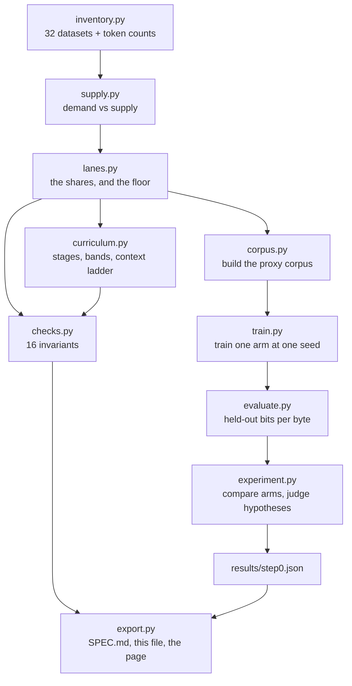
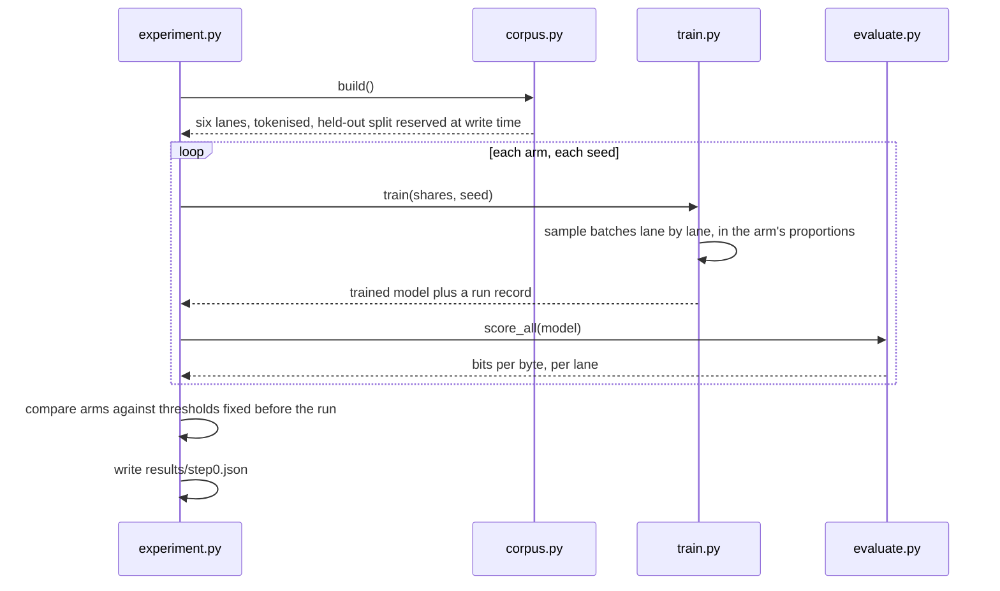

# How this was measured

Generated by `uv run python -m mixture`. Every figure here comes from the same modules the tests
pin — if a number in this document is wrong, a test is wrong with it.

**Start here if the words `H1`, `E2`, `arm` or `bits per byte` have appeared without explanation.**
`SPEC.md` is the decision; this is the machinery behind it.

---

# 1 · The problem, in one paragraph

We are choosing what a 40-billion-parameter model reads. The budget is 2T
tokens, and the deliverable is a set of percentages: how much general web, how much code, how much
Indic, and so on. Those percentages cannot be tested at 40B — a single attempt costs months and a
large amount of money. So we test them on a model small enough to train in seconds, and we are
explicit about what that does and does not prove.

# 2 · The vocabulary, once

Six words do all the work in these documents.

| term | what it means |
| --- | --- |
| **lane** | One kind of text. Seven here: general web, code, Indic, STEM, reasoning, agentic, long-context. A *share* is the fraction of the budget it gets. |
| **arm** | One training run with one mixture. Four arms = the same model trained four times on four sets of proportions, nothing else different. |
| **epoch** | One full pass over a lane's text. `1.33 epochs` means read it once, then a third of it again. |
| **seed** | The random number fixing initial weights and data order. The *same* recipe at two seeds scores slightly differently, and that gap is the noise floor. |
| **held-out** | Text reserved before training and never trained on. Scores use only this, because a model asked about text it memorised tells you nothing. |
| **stand-in** | Text used in place of a dataset too large or too restricted to use here. GSM8K stands in for peS2o — same *kind* of text, not the same text. |

# 3 · What we actually trained

| | |
| --- | --- |
| model | 4-layer transformer, 256 wide, 4 heads, **~5.8M parameters** |
| context | 256 tokens |
| vocabulary | 10,000 tokens, the Session 2 tokenizer |
| schedule | 500 steps x batch 16 = **2,048,000 tokens seen per run** |
| repeats | 5 seeds per arm |
| hardware | `mps:apple-silicon` |

**That model is roughly 7,000× smaller than the one the specification is about.** It is not a small
version of V5. It is an instrument for comparing mixtures, and every claim made from it is stated
with that limit attached.

## The corpus it read

| `web` | 100,661 | 10,331 | 59,861 | 0.00% |
| `indic` | 70,574 | 8,228 | 66,427 | 0.00% |
| `code` | 352,415 | 37,162 | 77,843 | 0.17% |
| `stem` | 239,401 | 26,532 | 62,545 | 0.01% |
| `reasoning` | 558,783 | 61,787 | 138,835 | 0.20% |
| `agentic` | 462,378 | 50,273 | 117,411 | 0.01% |

Total: **1,784,212 training tokens** across 6 lanes. `[UNK]` is the share of
text the vocabulary cannot represent; above 5% a lane is refused, because a count that is mostly
unknown-token is not a count.

---

# 4 · The pipeline, end to end



Everything above the dotted line is arithmetic over a dataset inventory and needs no GPU. Only
`train.py` and `evaluate.py` need torch, which is why it is an optional extra and CI never installs
it.

## What one run looks like



The held-out split is reserved **when the corpus is written**, not when it is evaluated. That is
what makes it impossible for the evaluator to score a model on text it trained on: the two live in
different arrays on disk.

---

# 5 · Bits per byte, properly

This is the number every comparison is made on, so it is worth understanding rather than trusting.

**What it measures: how surprised the model is by text it has never seen.** Lower is better.

The model reads held-out text one token at a time and, at each position, produces a probability for
what comes next. If it says the next token is 25% likely and it is right, it was moderately
surprised. If it says 0.1%, it was very surprised. Sum that surprise across the passage and you
have the total.

The arithmetic, exactly as `evaluate.py` does it:

```
nats      = sum over positions of  -ln P(actual next token)
bits      = nats / ln(2)
bits/byte = bits / (UTF-8 bytes of the held-out passage)
```

**Why per byte and not per token.** A token is an arbitrary unit — change the tokenizer and every
token count changes, so a per-token score cannot be compared across vocabularies. A byte is fixed.
This matters here because the specification openly plans to replace the tokenizer, and a metric
that moved when it did would be worthless.

**Why not perplexity**, which is what most people recognise. Perplexity is per *token*, so it has
exactly the problem above. `evaluate.py` computes it and reports it beside the score, but it is
never used to rank arms.

**One trap, and it is on the page.** Indic scores lower than code on every arm. That is not Indic
being easier. Devanagari costs about three bytes per character in UTF-8, so the same information is
spread over more bytes and each byte carries fewer bits. **Read down a column, never across a row.**

---

# 6 · The three hypotheses — H1, H2, H3

A hypothesis is a claim about the mixture, written down **with its threshold, before any arm ran**.
That ordering is the whole point: pick the threshold afterwards and you will pick the one that
flatters the result.

| | claim | supported if | refuted if |
| --- | --- | --- | --- |
| **H1** | arm A beats arm B on run-weighted held-out bits-per-byte | ≥2% on web, code, indic, stem, reasoning | A is within 2% of B, or worse. Then composition bought nothing at this scale and the spec says so rather than keeping the shares and hoping they matter at 40B |
| **H2** | removing the protected floor makes Indic materially worse | ≥5% on indic | arm C's Indic bits-per-byte is within 5% of arm A's. Then the floor is ceremony at this scale and its justification rests on V4's selector behaviour alone, which the spec must then state as its only evidence |
| **H3** | halving Indic costs Indic more than it gains the other lanes | ≥3% on indic | arm D's Indic bits-per-byte is within 3% of arm A's, or the other lanes gain more than 1%. Then 18% is over-provisioned and the share should fall toward the 12% floor |

And the four arms they are judged across:

| | mixture | the question it answers |
| --- | --- | --- |
| **A** | V5 candidate | does the composed mixture do what the spec claims? |
| **B** | Naive web-heavy | does composing a mixture beat crawling whatever is cheapest? if not, every argument in this spec is decoration |
| **C** | No protected floor | does the floor buy anything, or is it ceremony? this is what an English-heavy selector left unchecked would produce |
| **D** | Indic halved | is 18% defensible, or would 9% have bought the same thing? |

Every arm is scored with **the candidate's weights**, not its own. Weighting each arm by its own
mixture would let an arm win by caring only about what it chose to train on.

## What they returned

| | measured on | effect | threshold | seed spread | verdict |
| --- | --- | ---: | ---: | ---: | --- |
| **H1** | `weighted` | +4.21% | 2% | 1.11% | **supported** |
| **H2** | `indic` | +6.88% | 5% | 1.55% | **supported** |
| **H3** | `indic` | +3.52% | 3% | 2.06% | **refuted** |

**Two rules decide these, and both can only cost this specification marks.** An effect smaller than the spread the same arm shows against itself is reported as `inconclusive`, however large it looks — that is what the *seed spread* column is for. And a refutation condition with more than one clause is checked on every clause, not just the convenient one.

**H3 — refuted.** the primary effect holds (+3.52%), but stem gains 1.12%, past the 1% the refutation condition names, and that gain clears its own seed spread. The condition was declared before the run as: arm D's Indic bits-per-byte is within 3% of arm A's, or the other lanes gain more than 1%. Then 18% is over-provisioned and the share should fall toward the 12% floor.

---

# 7 · The four follow-up experiments — E1 to E4

The hypotheses test the *mixture*. These four test the *assumptions the specification leans on*.
They are separate runs, not extra arms.

### E1 · What is a re-read token actually worth?

**Why it was asked.** The whole supply analysis borrows a ceiling — a pool is never worth more than `unique x 16.4` — and that constant is what makes a lane *impossible* rather than merely expensive. It had never been checked on our own data.

**How.** Hold the training budget fixed and shrink the unique pool: every rung does identical work over less distinct text, so any difference is the price of re-reading rather than the price of training less.

**What came back.** **Repetition measurably costs held-out loss at this scale.** Not monotone — one adjacent pair runs the wrong way, but by less than the seed spread, so the grid is finer than this experiment can resolve there.

**Run it:** `uv run python -m mixture.repetition`

### E2 · Does a warmup band at a stage seam calm the gradient?

**Why it was asked.** The curriculum puts a warmup band at every stage boundary on the strength of one number from the session — V4 spiked its gradient norm ~150x at a Hindi seam. This specification promised the weaker test it *could* run, and had not run it.

**How.** Two identical runs — same seeds, same steps, same mixtures either side — where one changes mixture between one step and the next and the other blends across a band. Gradient norm is logged every step so the seam is observed rather than sampled near.

**What came back.** **Inconclusive.** The +0.114 difference in peak ratio sits inside the 0.175 spread the conditions show against themselves, so this cannot rank them. The difference points the band's way, which is worth nothing on its own and is reported only so the next run knows which way to look.

**More seeds would not settle this**, and that is a property of the rule rather than of the budget: the comparison is against the *sample spread*, which does not shrink with n, not against a standard error, which does. That rule is deliberately conservative and is used everywhere in this repository. Resolving this would need a lower-variance statistic — the peak is a maximum over a window, which is about the noisiest summary available — and swapping the statistic after seeing the result would be changing the test rather than gathering more evidence for it. So it stands as inconclusive.

**Run it:** `uv run python -m mixture.seam`

### E3 · Does the arm ranking survive a change of scale?

**Why it was asked.** `SPEC.md` §7 admits that *mixture rankings transfer across scale* is an assumption and names its falsifier: a rank inversion between the smallest and largest arm. Naming a falsifier and never testing it is cheaper than it looks honest.

**How.** Every arm at four model sizes, from 1.7M to 30.5M parameters, with the ordering compared end to end.

**What came back.** **Assumption survives.** No pair reverses between the smallest and largest model, which is the falsifier §7 actually names. The ordering is **not** identical all the way through: 2 intermediate size(s) (5,785,088, 14,585,856) rank the middle of the field differently before it returns. The endpoints agreeing is what was tested; a monotone ranking at every scale is not what was observed.

**Run it:** `uv run python -m mixture.scale`

### E4 · Is the refutation real, or an artefact of one dataset?

**Why it was asked.** H3 fails on its second clause, and everything that clause sees arrives through the STEM lane — whose text is GSM8K standing in for peS2o. With the 1B rung deprioritised, this is the cheapest question still worth asking.

**How.** The same arms, seeds, steps and thresholds, with only the STEM lane's text replaced by a deliberately different stand-in: Stack Exchange mathematics instead of grade-school word problems.

**What came back.** **Refuted** — the same verdict as the headline run, with the second clause gaining 1.72% against its 1.52% spread.

**Run it:** see §9.

---

# 8 · What this cannot establish

Stated here as well as in `EXPERIMENTS.md`, because it is the part most easily lost:

- The corpus is **1,784,212 tokens** and the model is **~5.8M parameters**. Both are
  three orders of magnitude below where a mixture decision is really made.
- Three of the lanes are **stand-ins**. A finding that arrives through one of them rests on that
  substitution — which is why E4 exists.
- Two experiments agreeing is not two pieces of evidence when they share a corpus, a tokenizer and
  the same stand-in.
- **The 1B rung has not been run and is not scheduled.** It is priced in `SPEC.md` §7 and stated as
  an unrun commitment rather than quietly dropped.

# 9 · Reproducing any of it

```bash
uv sync --all-packages --extra proxy      # torch, only needed for the training parts

uv run python -m mixture                  # rebuild every generated document
uv run python -m mixture.corpus           # build the proxy corpus
uv run python -m mixture.experiment       # the four arms and the three hypotheses
uv run python -m mixture.repetition       # E1
uv run python -m mixture.seam             # E2
uv run python -m mixture.scale            # E3
```

E4 is the same experiment as the headline run with a different STEM stand-in:

```bash
uv run python src/exercises/05-datamixtures-and-curriculum/tools/fetch_proxy_corpus.py --alt-stem
MIXTURE_STEM=alt uv run python -m mixture.experiment
```

**Check the `device` field in any result before believing a throughput number.** A sandbox that
blocks the OS-version query makes `torch.backends.mps.is_available()` return `False`, and the
harness then trains on CPU without saying so.
